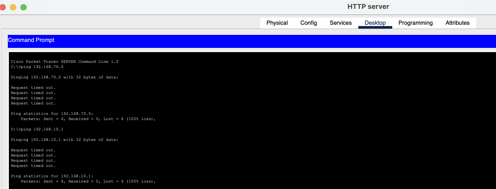

# Perimeter & DMZ Security Verification Log

**Date Verified:** July 2026  
**Status:** 🟩 PASSED  

This log verifies edge-boundary integrity on the Cisco ASA 5506-X Firewall[cite: 1]. It confirms that public traffic can access front-facing edge resources safely, while DMZ environments are strictly prevented from pivoting laterally into private corporate network zones[cite: 1].

---

## 🧪 Test Execution & Results

### Test 1.1: Inbound Public Web Access (Outside -> DMZ)
*   **Action:** Opened the web browser on an external host situated past the **ISP Router**[cite: 1]. Navigated to the public NAT IP address of the DMZ web server[cite: 1].
*   **Observed Behavior:** The corporate landing page successfully loaded over HTTP/HTTPS.
*   **Security Assessment:** Successful. Port forwarding and static NAT configurations on the firewall are operating within spec.

### Test 1.2: DMZ Lateral Containment (DMZ -> Inside)
*   **Action:** Opened the desktop Command Prompt on the **DMZ HTTP Web Server** (`192.168.90.2`)[cite: 1]. Attempted to ping the internal AAA/RADIUS server and the Production client gateway[cite: 1]:
    ```cmd
    ping 192.168.70.5
    ping 192.168.10.1
    ```
*   **Observed Behavior:** Both connection attempts returned `Request timed out` (100% packet loss).
*   **Security Assessment:** Successful. The perimeter firewall is actively dropping unauthorized DMZ-originated traffic heading toward the inside network topology.

---

## 📸 Verification Evidence
Below is the terminal capture proving successful packet drop across the security boundary:

